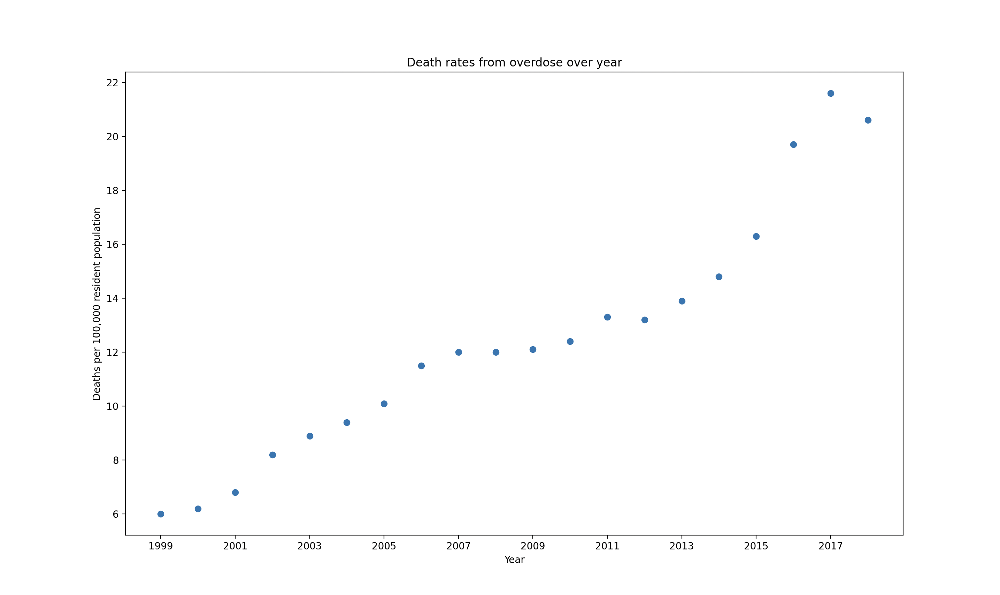

[](https://github.com/nogibjj/Meron_Gedrago_miniprojt2/actions/workflows/CI.yml)
# Meron_Gedrago_miniproject2

Welcome to the second mini project for Data Engineering!

## Structure for this project 

This project aims to build on top of the first week's mini project where we built the following. Find below the structure of the project and find the documents that we will discuss further in this project in *italic*
```
├── .devcontainer/
│   ├── devcontainer.json
│   └── Dockerfile
├── .github/
│   └── workflows/
│       ├── CI.yml
├── .gitignore
├── Requirements.txt
├── Makefile
├── *README.md*
├── *MG_main.py*
├── *Data_visual.png*
└── *test_MG_main.py*
```
The main focus of this project are in the following documents: 

* *README.md*: This is the document that you are reading right now that explains the purpose of the project as well as the analysis performed in MG_main.py and the findings from the analysis. 
* *MG_main.py*: I created four functions in this file
    1. *load_dataset(dataset)*: loads and reads a csv file    
    2. *describe_data(data)*: inputs a column or row of interest and outputs the mean, median and standard deviation for the column/row or group
    3. *find_min_and_max(data)*: input a column or row of interest and outputs the min and max of the column/row or group
    4. *create_graph(data)*: creates a scatterplot from the data that has been given 
* *Data_visual.png*: a picture that has been generated from the *create_graph* function 
* *test_MG_main.py*: a series of functions that test if the functions from *MG_main.py* are working correctly using a random test dataset *test_organization.csv* 

## Purpose of this project and findings 

Source of the dataset: https://catalog.data.gov/dataset/drug-overdose-death-rates-by-drug-type-sex-age-race-and-hispanic-origin-united-states-3f72f/resource/e8eca080-11f4-4ff6-85f6-5476093f5361 

The dataset looks at the death in the United States over the years due to drugs. The data has multiple columns and breaks down where the death rates are coming from. For this project, 
I will just be focusing on looking at the trend of death rates over the year. Therefore, I had to filter the dataset in *MG_main.py*. 
From the analysis, there is an average of 12-13 per 100,000 people losing their lives due to drugs and that the number was at its low when this rate was 6 in 1999 and has been steadily increasing since then with a small decrease in 2017. 

```
The mean is 12.45; the median is 12.05; the standard deviation is 4.507012080606934
The max is 21.6 and the min is 6.0

```




